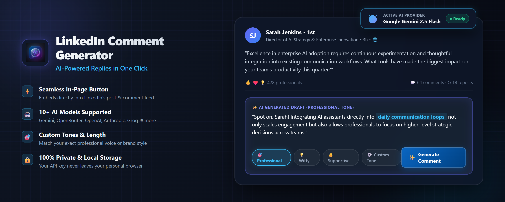

# LinkedIn Comment Generator



[](https://github.com/ronisarkar-official/linkedin-comment-generator/releases/latest)
[](https://github.com/ronisarkar-official/linkedin-comment-generator/blob/main/LICENSE)
[](https://developer.chrome.com/docs/extensions/mv3/)

<div align="center">
<a href="https://www.producthunt.com/products/linkedin-comment-generator?embed=true&amp;utm_source=badge-featured&amp;utm_medium=badge&amp;utm_campaign=badge-linkedin-comment-generator" target="_blank" rel="noopener noreferrer"></a>
</div>

A Manifest V3 Chrome extension that adds an inline **Generate Comment** button directly to LinkedIn posts. It sends post text through the background service worker to your chosen AI provider (Gemini, OpenRouter, OpenAI, Anthropic, Groq, and more), generates professional, witty, and supportive comment variants, and inserts your selected draft into LinkedIn's comment editor with one click.

---

## 🚀 Download & Install

### Option 1: Microsoft Edge Add-ons (Recommended)

Visit the [**LinkedIn Comment Generator**](https://microsoftedge.microsoft.com/addons/detail/linkedin-comment-generato/bgnnpcjchmccpijnlmpnciceabogpmpg) page on the Microsoft Edge Add-ons store and click **Get**. The extension works in both Microsoft Edge and Chrome.

### Option 2: Build from Source

```bash
git clone https://github.com/ronisarkar-official/linkedin-comment-generator.git
cd linkedin-comment-generator
npm install
npm run build
```

Then open `chrome://extensions` (or `edge://extensions`), enable **Developer mode**, and load the `dist/` directory as an unpacked extension.

---

## 🔑 API Key Setup

1. Open the extension popup by clicking the extension icon
2. Select your preferred AI provider (Gemini, OpenRouter, OpenAI, etc.)
3. Paste your API key and click **Save**
4. Choose your preferred tone and comment length

> Your API key is stored **only** in `chrome.storage.local` — it never leaves your browser except to call the AI provider directly.

---

## ✨ Features

- 🤖 **Multi-provider AI support** — Gemini, OpenRouter, OpenAI, Anthropic, Groq, Together, Mistral, DeepSeek, Cohere, Perplexity, and xAI
- 🎯 **Tone matching** — Professional, witty, supportive, and more
- 📏 **Adjustable length** — Short, medium, or detailed comments
- 📝 **One-click insertion** — Generated comments are inserted directly into LinkedIn's editor
- 📜 **History** — Stores up to 50 recent generations locally
- 🔒 **Privacy-first** — No intermediary server, no data collection, no ads

---

## 🔐 Permissions Explained

| Permission        | Why it's needed                                                                 |
| ----------------- | ------------------------------------------------------------------------------- |
| `storage`         | Stores your API key, provider choice, tone, length, and comment history locally |
| `activeTab`       | Enables interaction with the active LinkedIn tab when you click the extension   |
| `scripting`       | Manages page integration to add the Generate Comment button                     |
| `linkedin.com`    | Identifies posts, renders controls, and inserts selected comments               |
| AI provider hosts | The background service worker calls your chosen AI provider directly            |

---


---

## 🛠️ Development

### Requirements

- Node.js 20.19+
- npm 10+

### Commands

```bash
npm install        # Install dependencies
npm run dev        # Start dev server with hot reload
npm run build      # Production build to dist/
npm run typecheck  # TypeScript type checking
```

---

## 🔒 Privacy

- All settings and history are stored **locally** in your Chrome profile
- Post text is sent **directly** from the extension to your chosen AI provider — no intermediary server
- The extension does **not** collect, sell, or use data for advertising
- Uninstalling the extension removes all stored data

---

## ⚠️ Known Limitations

- LinkedIn frequently changes class names and editor structure — the extension includes fallback selectors but may need updates
- Rate limiting: 5 generation requests per rolling minute, with 8-second debounce per post
- AI provider quotas and model availability may change independently
- Some promoted posts or reshared content may have different DOM structures

---

## 📄 License

This project is licensed under the [MIT License](LICENSE).
